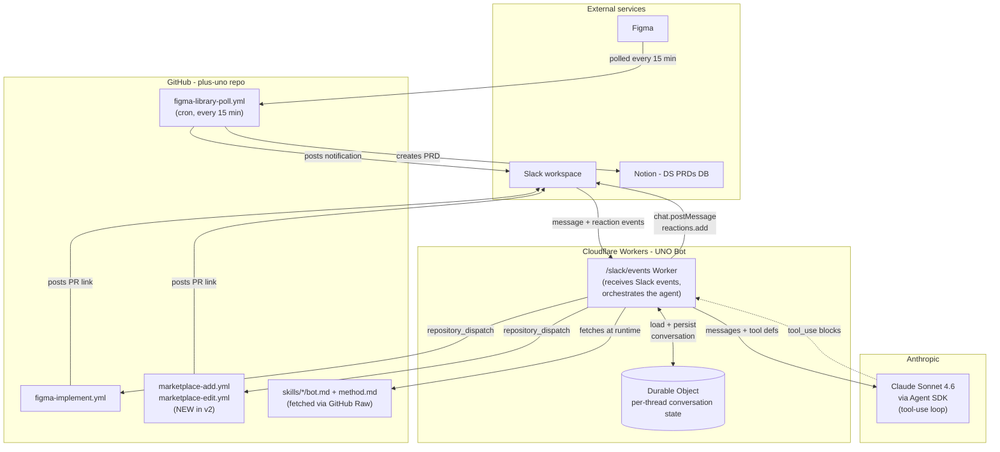
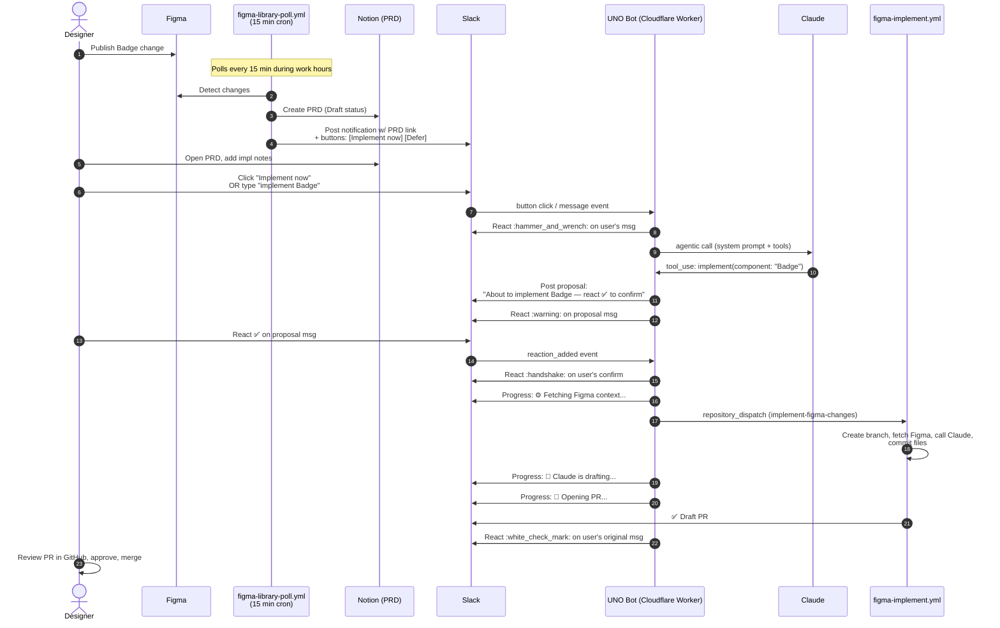
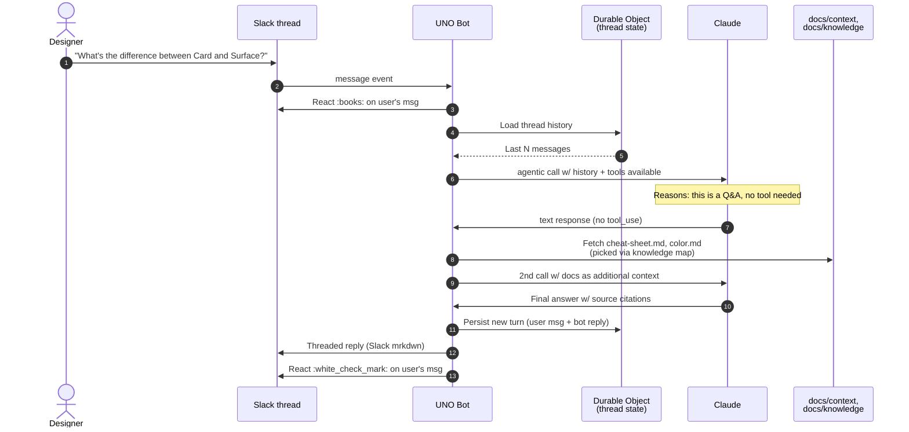
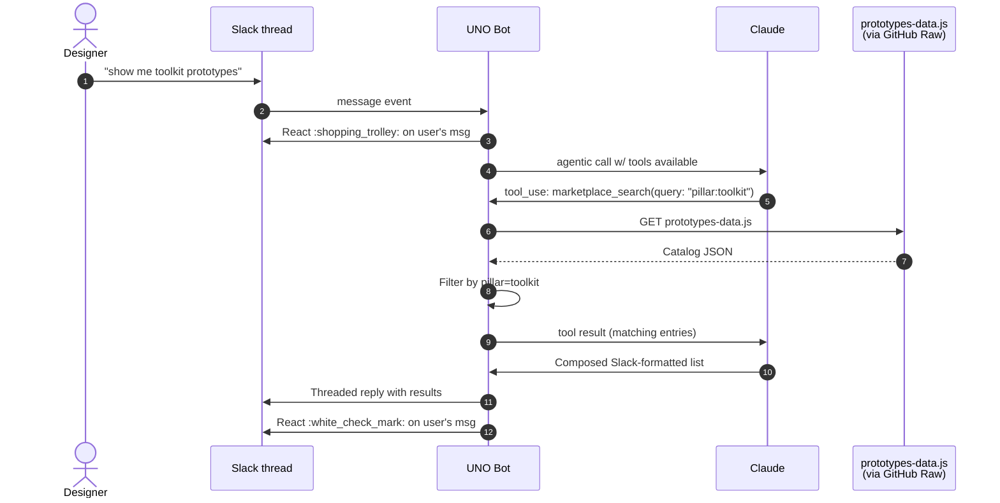
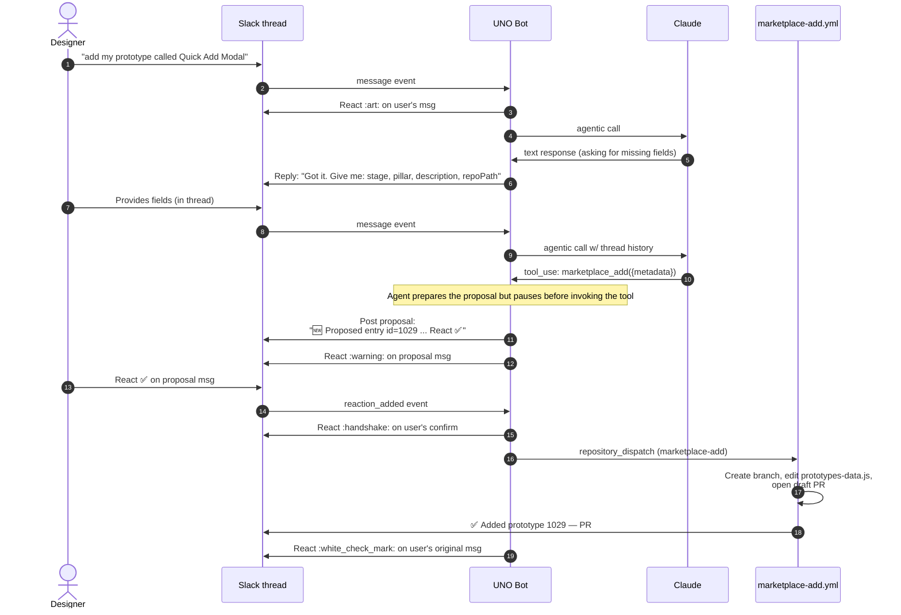
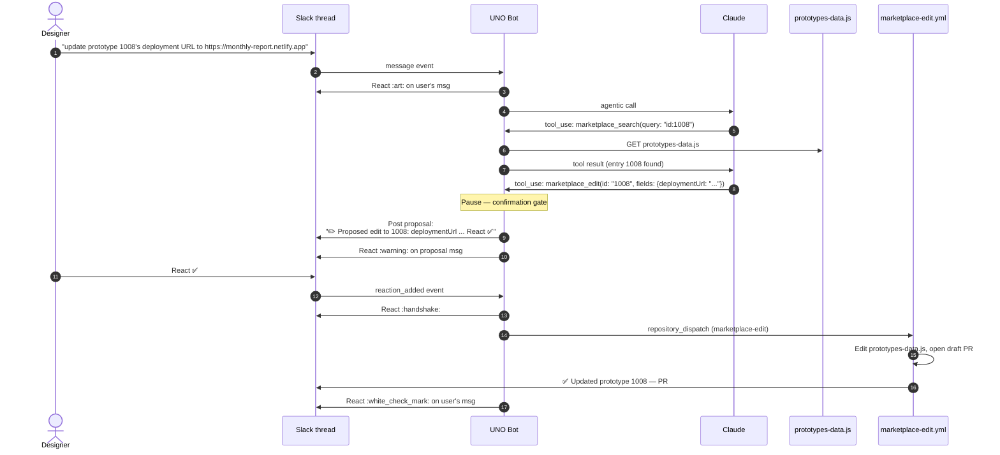
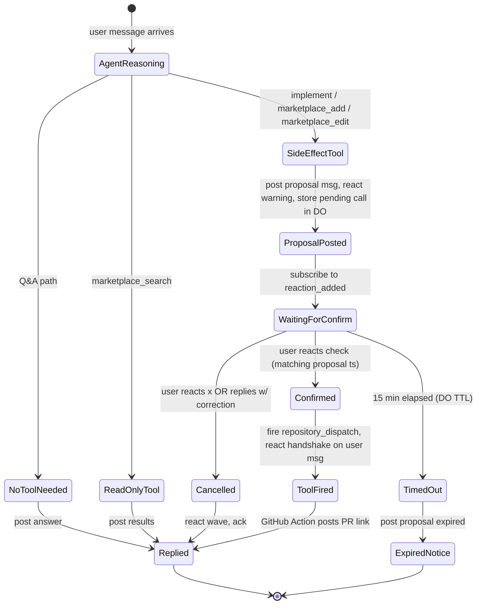

# UNO Bot v2 — Flowcharts

> Week 1 deliverable per `~/.claude/plans/piped-riding-melody.md`. One diagram per primary use case, plus an overview architecture diagram. Format: Mermaid (renders natively in GitHub, GitLab, Notion, etc.). Audience: Bryan + Bill, also a starting point for the Week 3 article.
>
> Author: Bryan • Date: 2026-05-20

## Overview architecture

The system around the v2 bot. Shows where the bot sits relative to GitHub Actions, Slack, Notion, Figma, and Anthropic. Updated to reflect the **Cloudflare Workers + Durable Objects** recommendation from the platform research doc; if Bill picks differently in Friday's decision, the "Cloudflare Workers (UNO Bot)" box gets swapped.

Key points:
- **Polling pipeline is untouched.** `figma-library-poll.yml` runs on its own cron, completely independent of the bot.
- **Skills are fetched at runtime.** The Worker pulls SKILL.md files from GitHub Raw on each invocation (cached by Anthropic's prompt caching after first hit, so this is cheap).
- **All side effects route through GitHub Actions.** The bot never writes to the repo directly — it dispatches to an Action, the Action does the writing. Keeps the bot stateless on the repo side; the GitHub Action's PR is the audit trail.

---

## 1. Implement flow

The most important flow — what designers do most often. A Figma change → bot opens a draft PR.

Notes:
- Steps 8-14 are the **confirmation gate** — explicit user ✅ before the GitHub Action fires. Non-negotiable for side-effect-bearing tools.
- Progress messages (steps 17-19) come from the Worker as the GitHub Action runs. The Worker doesn't actually know what stage the Action is in — it emits progress at predictable timing points OR (better) the Action posts back to the Worker via a webhook for true progress.
- The polling-to-Slack chain (steps 1-4) is identical to today; no v2 changes to that subsystem.

---

## 2. Q&A flow

The default conversational mode. Designer asks a question; agent answers directly without invoking a tool.

Notes:
- Steps 4-5 are the **thread memory** — every Q&A call loads prior turns so "now do the same for Button" works.
- Steps 7-11 are the **two-pass classify-then-fetch pattern** from the AGENT.md conversational default (formerly uno-qa). First call: Claude decides whether tools are needed and which docs to read. Second call: Claude composes the answer with the fetched docs in context.
- No tool call = no confirmation gate. Q&A is the bot's "default" mode.

---

## 3. Marketplace search flow

Read-only marketplace operation. Simplest of the marketplace flows.

Notes:
- No confirmation gate (read-only).
- The agent invokes `marketplace_search` directly because the message clearly asks for it.
- The bot fetches the live `prototypes-data.js` on each search to ensure fresh data — could be cached for 5 min if hit rate becomes an issue.

---

## 4. Marketplace add flow

Add a new prototype. Requires conversational field collection + confirmation gate before opening the PR.

Notes:
- Steps 5-8 are the **conversational field collection**. The agent asks for missing required fields; the user replies in the thread; the agent waits.
- Step 9-10: thread memory carries the previous turns so the agent knows what's been collected.
- Step 12-13: the proposal-and-react pattern is the **confirmation gate**. The tool invocation in step 12 is *deferred* — the agent generates the tool_use block but the Worker holds it pending the ✅. (Implementation detail: the Worker stores the pending tool call in the Durable Object, keyed by the proposal message's ts, and only fires when the reaction event matches.)

---

## 5. Marketplace edit flow

Edit an existing prototype's metadata. Similar to add but the agent first does a `marketplace_search` to confirm the entry exists.

Notes:
- Step 5-7 show **multi-tool reasoning** in action. The agent first calls a read-only tool (`search`) to confirm the entry exists, then calls the side-effect tool (`edit`). One agentic call, two tool invocations.
- If the agent finds via search that the entry doesn't exist, it would skip the edit and reply with "I don't see prototype 1008 — did you mean X?" — no confirmation gate fires because no destructive tool was invoked.

---

## 6. Confirmation-gate state machine (cross-cutting)

How the **confirmation gate** actually works at the platform level. This isn't a use-case flow — it's the orchestration pattern that all side-effect tools share.

Key behaviors:
- **State is stored in the Durable Object.** Keyed by the proposal message's `ts` (Slack message timestamp). When a reaction comes in, the Worker queries the DO by `item.ts` to find the matching pending call.
- **TTL of 15 min on pending proposals.** Prevents stale proposals from being fired hours later. Configurable.
- **User can cancel via ❌ or correction.** If they reply with a correction, the agent re-prompts (back to ProposalPosted with updated parameters).

---

## What's NOT diagrammed here

- **Error states.** Each flow has error paths (Claude API fails, GitHub dispatch 404, etc.) — not drawn to keep diagrams readable. The Worker should react `:x:` on user's msg + post error message in thread on any uncaught exception.
- **First-message-in-thread vs follow-up.** The Q&A flow above is a single turn. Multi-turn follow-ups ("now do that for Button") use the same flow with the thread history loaded.
- **Polling failure modes.** If the cron fails (Figma API down, Notion API down), it logs and retries on next cycle. Not bot-facing.

---

## Open questions on these diagrams

1. **Progress messages during implement (flow 1, steps 17-19):** are these worth the implementation complexity? The friction-audit doc proposed them but they require either timed emission from the Worker (best-effort) or a webhook back from the GitHub Action (more reliable, more wiring). Decide in Week 2.
2. **Confirmation TTL (15 min)** — right number? Could be 5 min (tight, forces fast decisions), could be 60 min (loose, but stale-state risk). Let's pick 15 as the default and tune from usage.
3. **Should the `:warning:` reaction on the bot's proposal also work the other way — bot proposes → user reacts `:warning:` to mean "yes do it"?** That's confusing UX. Better: ✅ for confirm, ❌ for cancel, everything else ignored.

End of flowcharts.
