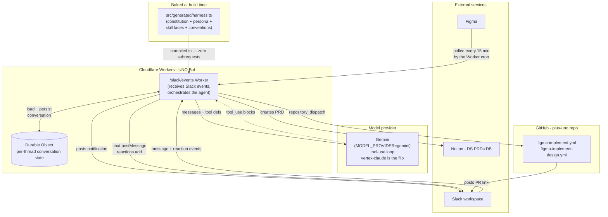
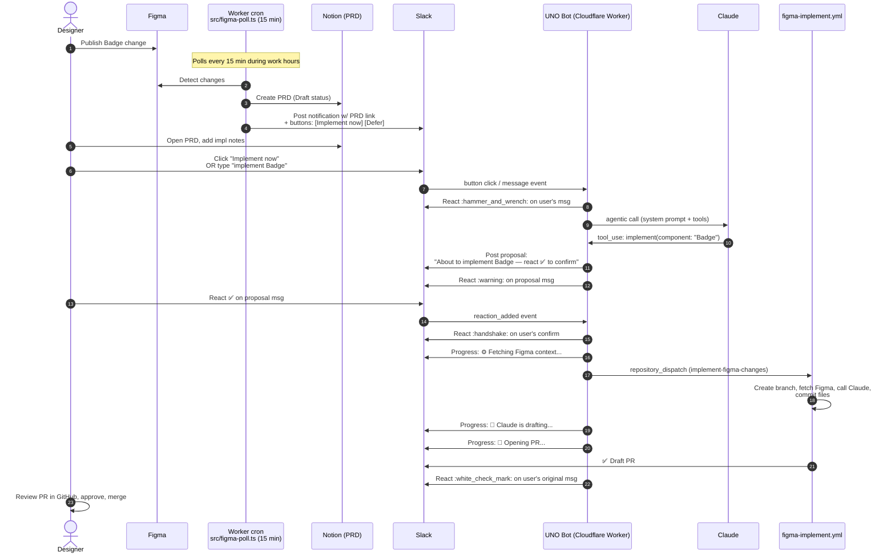
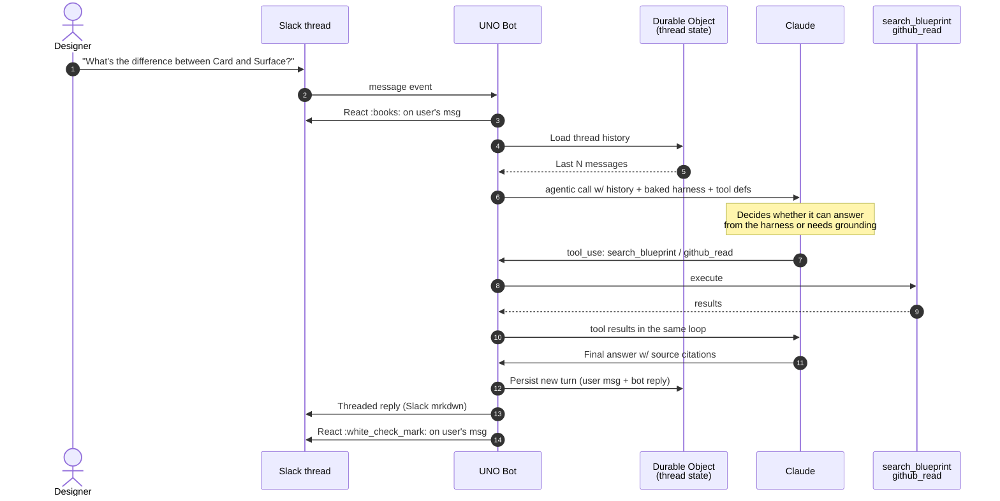
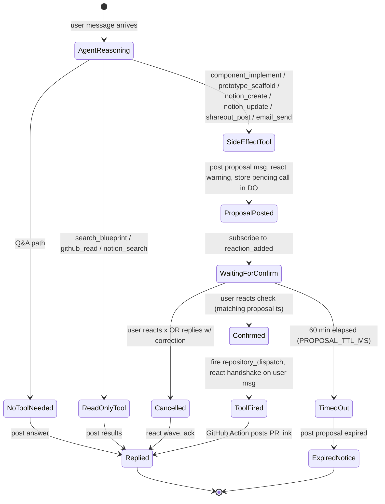

# UNO Bot v2 — Flowcharts

> Originally a Week-1 design deliverable. Author: Bryan • Date: 2026-05-20.
>
> **Audited against code 2026-08-24 (#158).** Every diagram below was checked
> claim-by-claim, not just the one that was obviously wrong. Three marketplace
> flows were **deleted** — the tools they diagram (`marketplace_search`,
> `marketplace_add`, `marketplace_edit`) do not exist in
> `agents/uno-bot/tool-definitions.json`, and the two stub workflows they
> dispatched to were deleted in the same change. The four that remain were
> **corrected**; each carries an audit note saying what was verified.
>
> This is current-state documentation. A claim here that the code contradicts
> is a bug in this file — file it through `uno-maintain`.

## Overview architecture

The system around uno-bot: where it sits relative to GitHub Actions, Slack, Notion, Figma, and the model provider.

**Audit 2026-08-24 — corrected in four places.** The Figma poll is a Worker
cron (`src/figma-poll.ts`), not `figma-library-poll.yml`, which no longer
exists. The harness is **baked into the bundle at build time**
(`src/generated/harness.ts`) and served as a constant — the original diagram
had the Worker fetching skills from GitHub Raw on every invocation, which is
the opposite of what happens and the reason the bundle costs zero subrequests.
The model provider is **Gemini** (`MODEL_PROVIDER = "gemini"`, wrangler.toml),
not Claude via the Agent SDK. The marketplace dispatch box is gone.

```mermaid
flowchart TB
  subgraph external["External services"]
    Figma[Figma]
    Slack[Slack workspace]
    Notion[Notion - DS PRDs DB]
  end

  subgraph platform["Cloudflare Workers - UNO Bot"]
    Worker["/slack/events Worker<br/>(receives Slack events,<br/>orchestrates the agent)"]
    DO[("Durable Object<br/>per-thread conversation state")]
  end

  subgraph model["Model provider"]
    Claude["Gemini<br/>(MODEL_PROVIDER=gemini)<br/>tool-use loop<br/>vertex-claude is the flip"]
  end

  subgraph github["GitHub - plus-uno repo"]
    ImplAction["figma-implement.yml<br/>figma-implement-design.yml"]
  end

  subgraph baked["Baked at build time"]
    Skills["src/generated/harness.ts<br/>(constitution + persona +<br/>skill faces + conventions)"]
  end

  Figma -->|"polled every 15 min<br/>by the Worker cron"| Worker
  Worker -->|"creates PRD"| Notion
  Worker -->|"posts notification"| Slack
  Slack -->|"message + reaction events"| Worker
  Worker <-->|"load + persist<br/>conversation"| DO
  Worker -->|"messages + tool defs"| Claude
  Claude -.->|"tool_use blocks"| Worker
  Worker -->|"repository_dispatch"| ImplAction
  Skills -->|"compiled in — zero subrequests"| Worker
  Worker -->|"chat.postMessage<br/>reactions.add"| Slack
  ImplAction -->|"posts PR link"| Slack
```

Key points:
- **The Figma poll lives in the Worker.** `src/figma-poll.ts` runs on a Worker cron (`*/15 13-23 * * 1-5`), ported off GitHub Actions in July 2026. `figma-library-poll.yml` no longer exists.
- **The harness is baked, not fetched.** `bundle-harness.mjs` assembles it at build time from every doc declaring `embodiment: all | uno-bot`, and `src/agent/skills.ts` serves the constant. Zero subrequests, updates on deploy.
- **Repo side effects route through GitHub Actions.** uno-bot never writes to the repo directly — it dispatches, the Action writes, the draft PR is the audit trail. It does write directly to Notion and Slack.

---

## 1. Implement flow

The most important flow — what designers do most often. A Figma change → uno-bot opens a draft PR.

**Audit 2026-08-24 — corrected in one place, confirmed elsewhere.** The poll
participant was `figma-library-poll.yml`; it is now the Worker cron. Confirmed
against code: `figma-implement.yml` exists and is dispatched via
`src/tools/github-dispatch.ts`; the confirmation gate is real
(`proposal_resolve` in `tool-definitions.json`).

```mermaid
sequenceDiagram
  autonumber
  actor D as Designer
  participant F as Figma
  participant Cron as Worker cron<br/>src/figma-poll.ts (15 min)
  participant N as Notion (PRD)
  participant S as Slack #uno-bot
  participant Bot as UNO Bot (Cloudflare Worker)
  participant Claude
  participant GH as figma-implement.yml

  D->>F: Publish Badge change
  Note over Cron: Polls every 15 min during work hours
  Cron->>F: Detect changes
  Cron->>N: Create PRD (Draft status)
  Cron->>S: Post notification w/ PRD link<br/>+ buttons: [Implement now] [Defer]

  D->>N: Open PRD, add impl notes
  D->>S: Click "Implement now"<br/>OR type "implement Badge"

  S->>Bot: button click / message event
  Bot->>S: React :hammer_and_wrench: on user's msg
  Bot->>Claude: agentic call (system prompt + tools)
  Claude->>Bot: tool_use: implement(component: "Badge")
  Bot->>S: Post proposal:<br/>"About to implement Badge — react ✅ to confirm"
  Bot->>S: React :warning: on proposal msg
  D->>S: React ✅ on proposal msg

  S->>Bot: reaction_added event
  Bot->>S: React :handshake: on user's confirm
  Bot->>S: Progress: ⚙️ Fetching Figma context...
  Bot->>GH: repository_dispatch (implement-figma-changes)
  GH->>GH: Create branch, fetch Figma, call Claude,<br/>commit files
  Bot->>S: Progress: 🤖 Claude is drafting...
  Bot->>S: Progress: 📝 Opening PR...
  GH->>S: ✅ Draft PR #47 ready
  Bot->>S: React :white_check_mark: on user's original msg

  D->>D: Review PR in GitHub, approve, merge
```

Notes:
- Steps 8-14 are the **confirmation gate** — explicit user ✅ before the GitHub Action fires. Non-negotiable for side-effect-bearing tools.
- Progress messages (steps 17-19) come from the Worker as the GitHub Action runs. The Worker doesn't actually know what stage the Action is in — it emits progress at predictable timing points OR (better) the Action posts back to the Worker via a webhook for true progress.
- The polling-to-Slack chain (steps 1-4) runs inside the Worker, not GitHub Actions — ported July 2026.

---

## 2. Q&A flow

The default conversational mode. Designer asks a question; the agent answers, reaching for a tool only when it needs grounding.

**Audit 2026-08-24 — corrected.** The original diagram showed a two-pass
classify-then-fetch against `docs/context` and `docs/knowledge`, picking docs
from a knowledge map. That is not what happens: there is one agentic loop, and
grounding comes from tools the model calls — `search_blueprint` for journey
facts, `github_read` for design-system and rule-doc facts (`AGENT.md` §Tool
routing). The doc paths in the old diagram no longer exist either. Confirmed:
thread history really is loaded from and persisted to the Durable Object
(`src/thread-state.ts`).

```mermaid
sequenceDiagram
  autonumber
  actor D as Designer
  participant S as Slack thread
  participant Bot as UNO Bot
  participant DO as Durable Object<br/>(thread state)
  participant Claude
  participant Tools as search_blueprint<br/>github_read

  D->>S: "What's the difference between Card and Surface?"
  S->>Bot: message event
  Bot->>S: React :books: on user's msg
  Bot->>DO: Load thread history
  DO-->>Bot: Last N messages
  Bot->>Claude: agentic call w/ history + baked harness + tool defs
  Note over Claude: Decides whether it can answer<br/>from the harness or needs grounding
  Claude->>Bot: tool_use: search_blueprint / github_read
  Bot->>Tools: execute
  Tools-->>Bot: results
  Bot->>Claude: tool results in the same loop
  Claude->>Bot: Final answer w/ source citations
  Bot->>DO: Persist new turn (user msg + bot reply)
  Bot->>S: Threaded reply (Slack mrkdwn)
  Bot->>S: React :white_check_mark: on user's msg
```

Notes:
- Steps 4-5 are the **thread memory** — every Q&A call loads prior turns so "now do the same for Button" works.
- Steps 6-11 are **one tool-use loop**, not two passes. The model calls a tool, the Worker executes it, results return to the same conversation. Which tool for which question is `AGENT.md` § Tool routing.
- No tool call = no confirmation gate. Q&A is the bot's "default" mode.

---

## 3. Confirmation-gate state machine (cross-cutting)

How the **confirmation gate** actually works at the platform level. This isn't a use-case flow — it's the orchestration pattern that all side-effect tools share.

**Audit 2026-08-24 — corrected in two places.** The retired `marketplace_add` /
`marketplace_edit` transitions are gone, and `marketplace_search` was the only
example of the read-only branch. The TTL is **60 minutes**
(`PROPOSAL_TTL_MS`, `src/thread-state.ts:85`), not the 15 the diagram claimed —
the value was tuned after this doc was written. Confirmed: pending proposals
really are keyed by the proposal message `ts` in the Durable Object.

```mermaid
stateDiagram-v2
  [*] --> AgentReasoning: user message arrives
  AgentReasoning --> NoToolNeeded: Q&A path
  AgentReasoning --> ReadOnlyTool: search_blueprint / github_read / notion_search
  AgentReasoning --> SideEffectTool: component_implement / prototype_scaffold /<br/>notion_create / notion_update / shareout_post / email_send

  NoToolNeeded --> Replied: post answer
  ReadOnlyTool --> Replied: post results

  SideEffectTool --> ProposalPosted: post proposal msg, react warning, store pending call in DO
  ProposalPosted --> WaitingForConfirm: subscribe to reaction_added

  WaitingForConfirm --> Confirmed: user reacts check (matching proposal ts)
  WaitingForConfirm --> Cancelled: user reacts x OR replies w/ correction
  WaitingForConfirm --> TimedOut: 60 min elapsed (PROPOSAL_TTL_MS)

  Confirmed --> ToolFired: fire repository_dispatch, react handshake on user msg
  Cancelled --> Replied: react wave, ack
  TimedOut --> ExpiredNotice: post proposal expired

  ToolFired --> Replied: GitHub Action posts PR link
  Replied --> [*]
  ExpiredNotice --> [*]
```

Key behaviors:
- **State is stored in the Durable Object.** Keyed by the proposal message's `ts` (Slack message timestamp). When a reaction comes in, the Worker queries the DO by `item.ts` to find the matching pending call.
- **TTL of 60 min on pending proposals** (`PROPOSAL_TTL_MS`, `src/thread-state.ts`). Prevents stale proposals from being fired hours later.
- **User can cancel via ❌ or correction.** If they reply with a correction, the agent re-prompts (back to ProposalPosted with updated parameters).

---

## What's NOT diagrammed here

- **Error states.** Each flow has error paths (Claude API fails, GitHub dispatch 404, etc.) — not drawn to keep diagrams readable. The Worker should react `:x:` on user's msg + post error message in thread on any uncaught exception.
- **First-message-in-thread vs follow-up.** The Q&A flow above is a single turn. Multi-turn follow-ups ("now do that for Button") use the same flow with the thread history loaded.
- **Polling failure modes.** If the cron fails (Figma API down, Notion API down), it logs and retries on next cycle. Not bot-facing.

---

## Open questions on these diagrams

1. **Progress messages during implement (flow 1, steps 17-19):** are these worth the implementation complexity? The friction-audit doc proposed them but they require either timed emission from the Worker (best-effort) or a webhook back from the GitHub Action (more reliable, more wiring). Decide in Week 2.
2. ~~**Confirmation TTL (15 min)** — right number?~~ **Settled:** 60 min, in `PROPOSAL_TTL_MS`.
3. **Should the `:warning:` reaction on the bot's proposal also work the other way — bot proposes → user reacts `:warning:` to mean "yes do it"?** That's confusing UX. Better: ✅ for confirm, ❌ for cancel, everything else ignored.

End of flowcharts.
