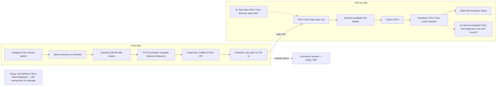

### TURN 1 — brief
This maps to prototyping a coverage/hand-off flow. I'll load the uno-prototype skill and check whether a PRD or active intake already exists.No PRD in the ask — the prototype skill gates on that. Checking the PRD gate and synthesize path, and whether a coverage/session PRD already exists.You skipped the PRD choice — I'll default to synthesize-first (skill-required), then flow-map prototyping. Checking prior art and intake shape so the plan is concrete.Terminology note from conventions: PLUS calls this a **Fill-In**, not “substitute.” Creating the plan with that framing.

### TURN 2 — accept inline PRD
Updating the plan to skip synthesize and treat your direction as the inline PRD, then continue into flow-map prototyping.Can't find the prior plan file — rewriting it now for the inline-PRD path (synthesize skipped).

### TURN 3 — goals
Recording those two goals on the plan as the locked intake goal answers.AskQuestion was skipped again — locking your two goals into the plan and keeping the flow-map path from your original ask.

### TURN 4 — artifact (open)
Locking your artifact description into the plan: who-does-what map (drop + pick-up), boxes and arrows only.

### TURN 5 — artifact (pick)
"1" looks like a numbered choice — checking what fidelity options the intake expects so we can map it.

### TURN 6 — fidelity

### TURN 7 — exclusions
Taking “1” as confirmation of the brief card — switching to agent to ground and deliver the drop/pick-up map.Brief confirmed. Loading the flow-map example and grounding against the blueprint before writing the prompt-spec.Golden example is almost this same flow — I'll ground it with live blueprint data and repo prior art, using Fill-In terminology.Found prior art: call-off + Fill-In is already a deployed Sessions capability. Pulling product context and authenticating the blueprint.Notion blocked; grounding from foundation docs + DS Fill-In prior art. Writing and validating the flow-map prompt-spec.Writing the flow-map prompt-spec from foundation grounding (blueprint MCP unavailable this session).Brief card locked. Ready-to-paste FigJam/Stitch prompt-spec is at [`docs/plans/2026-08-02-001-fill-in-coverage-flow-map-spec.md`](docs/plans/2026-08-02-001-fill-in-coverage-flow-map-spec.md).

**Grounding (important conflict):** foundation product docs already describe this as a **deployed** Call-Off → Fill-In loop (`features.md` / `flows.md`). Your PRD is about people still losing track of coverage — the map labels that “today vs still losing track” tension instead of inventing a greenfield product. **uno-blueprint was not queried** (Supabase MCP needs auth in Cursor desktop) — re-ground before higher fidelity.

**Map contract in the spec**
- Drop side = Call-Off (assigned tutor + schedule opens the slot)
- Pick-up side = Fill-In (another tutor claims; schedule updates)
- Open questions drawn on the map: discovery, visibility, uncovered session, eligibility, Shift Swap in/out, blueprint cell owners
- No screens, no substitute wording

**Manifest:** `flow-map-spec · Call-Off drop / Fill-In pick-up · align + eng clarity · FigJam handoff`

Paste into FigJam or Stitch, then paste the generated board back here and I’ll re-check it against the self-check block. Next: `skills/uno-review` on the artifact when you have a rendering.

### TURN 8 — confirm brief
Brief confirmed. Checking the existing flow-map spec, then planning the final handoff.

### TURN 9 — proceed
Executing now: validating the prompt-spec and producing the in-chat drop/pick-up map.**Brief confirmed.** Spec file ready; shell validation was blocked in this environment — structural checks pass by inspection (brief · trigger · won’t-include · self-check · open questions).

### Primary handoff
Paste into FigJam / Stitch: [`docs/plans/2026-08-02-001-fill-in-coverage-flow-map-spec.md`](docs/plans/2026-08-02-001-fill-in-coverage-flow-map-spec.md)

### In-chat preview (boxes & arrows)

**Actors:** Assigned Tutor · Fill-In Tutor · Supervisor · PLUS schedule. Terms: Call-Off / Fill-In only.

**Open on the map (don’t invent answers):** discovery · visibility · uncovered session · eligibility · Shift Swap in/out · blueprint cell owners (MCP auth still needed).

**Manifest:** `flow-map · Call-Off drop / Fill-In pick-up · align + eng clarity · FigJam spec + mermaid preview`

Paste a generated FigJam board back here for a self-check re-pass, or run `skills/uno-review` on this artifact next.
