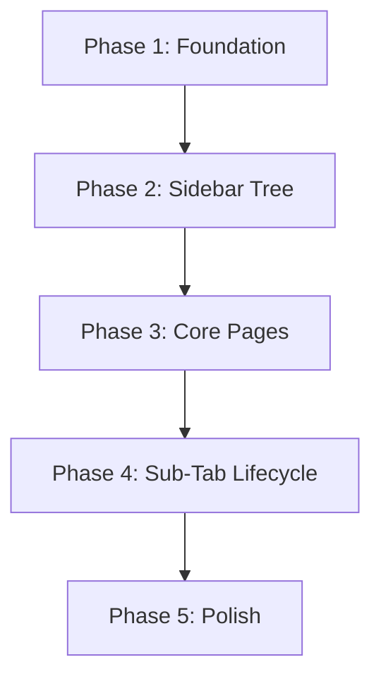

# feat: Toolkit Information Architecture Revision

## Overview

Restructure the Toolkit sidebar from a flat two-item list (Sessions, Reviews) into three accordion-style categories (Sessions, Students, Reflections) that support spawning dismissible sub-items when a tutor opens a specific session, student, or reflection. Sub-items auto-clear on browser session end, get real URLs, and cap at 2 levels of depth.

This is a **foundational IA change** (per PRD) that touches the Sidebar component, routing architecture, ShellContext, and introduces new list/detail pages for each category.

## Problem Statement

Today, the Toolkit section has a monolithic Sessions page that combines session management, student tracking, attendance, engagement, and reflection entry into a single view. Tutors cannot:
- Prepare for sessions by reviewing student history beforehand
- Reference student context while reflecting on a session
- Keep multiple sessions or student details "open" for quick switching
- Access a cross-session view of their student roster
- Review past reflections for preparation

The current sidebar is flat and static — every navigation change requires code changes to 3+ parallel maps (`pathToTab`, `pathToUserType`, `onTabClick`) plus the hardcoded `categories` array in `Sidebar.jsx`.

## Proposed Solution

### Target IA Structure

```
Toolkit
├── Sessions              ← /sessions (list of all sessions)
│   ├── Oct 15 3PM        ← /sessions/:id (spawned sub-tab, dismissible)
│   └── Oct 16 1PM        ← /sessions/:id (another open session)
├── Students              ← /students (cross-session student roster)
│   └── Kiera M.          ← /students/:id (spawned student detail)
└── Reflections           ← /reflections (reflection history/archive)
    └── Oct 15 Refl.      ← /reflections/:id (specific reflection)
```

### Key Decisions (from ideation, see origin)

| # | Decision | Rationale |
|---|----------|-----------|
| 1 | Sub-tabs auto-clear on browser session end | sessionStorage semantics; no server-side persistence needed |
| 2 | No cross-linking between categories | Opening a student from a session sub-tab redirects to Students, does not spawn a sub-tab under Sessions. StudentInsightsModal is **exempt** — it is a contextual overlay, not sidebar navigation |
| 3 | Max depth = 2 | Category > specific item only; breadcrumbs handle inner-page nesting |
| 4 | Real URLs | `/sessions/:id`, `/students/:id`, `/reflections/:id` — supports bookmarking, sharing, browser back/forward |
| 5 | Overflow with `...` | Per-category, 3 visible sub-tabs before overflow; click `...` reveals full list in a popover |
| 6 | Accordion headers are dual-purpose | Text/label area navigates to list; chevron icon toggles collapse |
| 7 | Multiple categories can be open simultaneously | `alwaysOpen={true}` — collapsing one category should not hide another's sub-tabs |
| 8 | Dismiss navigates to parent list | Dismissing the active sub-tab navigates to the parent category list (e.g., `/sessions`) |
| 9 | Reviews tab disposition | Reviews remains as-is for now; Reflections is a new addition, not a rename |

### High-Level Approach



## Technical Approach

### Architecture

#### Route Manifest (replaces 3 parallel maps)

Create a single declarative manifest that drives routing, sidebar state, breadcrumbs, and user type:

```jsx
// src/config/routeManifest.js
export const routeManifest = [
  {
    path: '/home',
    tabId: 'home',
    userType: 'tutor',
    breadcrumbs: [{ text: 'Home' }],
  },
  {
    path: '/sessions',
    tabId: 'sessions',
    userType: 'tutor',
    breadcrumbs: [{ text: 'Toolkit' }, { text: 'Sessions' }],
    category: 'toolkit',
  },
  {
    path: '/sessions/:id',
    tabId: 'sessions',        // parent category stays highlighted
    subTabKey: 'sessions',    // which category to spawn sub-tab under
    userType: 'tutor',
    breadcrumbs: [{ text: 'Toolkit' }, { text: 'Sessions', href: '/sessions' }, { text: ':label' }],
    category: 'toolkit',
  },
  {
    path: '/students',
    tabId: 'students',
    userType: 'tutor',
    breadcrumbs: [{ text: 'Toolkit' }, { text: 'Students' }],
    category: 'toolkit',
  },
  {
    path: '/students/:id',
    tabId: 'students',
    subTabKey: 'students',
    userType: 'tutor',
    breadcrumbs: [{ text: 'Toolkit' }, { text: 'Students', href: '/students' }, { text: ':label' }],
    category: 'toolkit',
  },
  {
    path: '/reflections',
    tabId: 'reflections',
    userType: 'tutor',
    breadcrumbs: [{ text: 'Toolkit' }, { text: 'Reflections' }],
    category: 'toolkit',
  },
  {
    path: '/reflections/:id',
    tabId: 'reflections',
    subTabKey: 'reflections',
    userType: 'tutor',
    breadcrumbs: [{ text: 'Toolkit' }, { text: 'Reflections', href: '/reflections' }, { text: ':label' }],
    category: 'toolkit',
  },
  // ... existing routes (lessons, admin, etc.)
];
```

A `matchRoute(pathname)` utility does prefix/pattern matching to replace the static `pathToTab` lookup.

#### Sidebar Component Extension

Extend the `Sidebar` component to support:
1. **Accordion categories** — Toolkit section renders as collapsible groups instead of flat items
2. **Dynamic sub-items** — each category can have spawned children stored in sessionStorage
3. **Dismiss affordance** — sub-items have an `x` close button
4. **Overflow** — more than 3 sub-items per category shows a `...` popover

```
Sidebar.jsx (extended)
├── Home tab (unchanged)
├── Category: Training (unchanged — flat items)
│   ├── SidebarTab: Lessons
│   └── SidebarTab: Onboarding
├── Category: Toolkit (new — accordion style)
│   ├── SidebarAccordionItem: Sessions (collapsible)
│   │   ├── SidebarSubTab: Oct 15 3PM [x]
│   │   ├── SidebarSubTab: Oct 16 1PM [x]
│   │   └── SidebarSubTab: ... (overflow)
│   ├── SidebarAccordionItem: Students (collapsible)
│   └── SidebarAccordionItem: Reflections (collapsible)
└── Category: Admin (supervisor only — unchanged)
```

New components needed:
- **`SidebarAccordionItem`** — wraps a category header (icon + text + chevron) with collapsible children. Header click navigates; chevron toggles. Uses React Bootstrap `Collapse` for animation.
- **`SidebarSubTab`** — variant of `SidebarTab` with indented styling, dismiss `x` button, and slightly smaller text. Fixed width matching parent (184px), with left indent (~16px).
- **`SidebarOverflow`** — `...` indicator that opens a `Popover` or dropdown listing all hidden sub-tabs with dismiss capability.

#### sessionStorage Schema

```json
// sessionStorage key: "toolkit_open_subtabs"
{
  "sessions": [
    { "id": "abc-123", "label": "Oct 15 3PM", "path": "/sessions/abc-123" },
    { "id": "def-456", "label": "Oct 16 1PM", "path": "/sessions/def-456" }
  ],
  "students": [
    { "id": "stu-789", "label": "Kiera M.", "path": "/students/stu-789" }
  ],
  "reflections": []
}
```

- Written on sub-tab spawn (navigating to a `/:id` route)
- Read on app mount to rehydrate sidebar state
- Cleared automatically when browser session ends (sessionStorage behavior)
- Per browser tab (inherent to sessionStorage — independent per tab, acceptable)

#### Sub-Tab Lifecycle Hook

```jsx
// useSubTabs.js — custom hook
function useSubTabs() {
  const [openTabs, setOpenTabs] = useState(() => readFromSessionStorage());

  const spawnTab = (category, { id, label, path }) => { /* add + persist */ };
  const dismissTab = (category, id) => { /* remove + persist + navigate if active */ };
  const getTabsForCategory = (category) => openTabs[category] || [];
  const isTabOpen = (category, id) => /* check */;

  return { openTabs, spawnTab, dismissTab, getTabsForCategory, isTabOpen };
}
```

This hook lives in `ShellLayout` and is passed down via context (or a new `SubTabContext`).

### Implementation Phases

#### Phase 1: Route Manifest Foundation

**Tasks:**
- Create `src/config/routeManifest.js` with all existing routes migrated from the 3 parallel maps
- Create `matchRoute(pathname)` utility with pattern matching for `:id` segments
- Refactor `ShellLayout` in `App.jsx` to derive `activeTab`, `userType`, and breadcrumbs from manifest instead of `pathToTab`/`pathToUserType`
- Refactor `onTabClick` to look up navigation targets from manifest
- Remove the 3 parallel maps (`pathToTab`, `pathToUserType`, inline `onTabClick` if-chain)
- Verify existing navigation still works identically

**Files modified:**
- `playground/prototyping/bill/home-redesign/src/App.jsx` — remove maps, use manifest
- New: `playground/prototyping/bill/home-redesign/src/config/routeManifest.js`
- New: `playground/prototyping/bill/home-redesign/src/utils/matchRoute.js`

**Success criteria:**
- All existing routes behave identically
- Adding a new route requires only a manifest entry
- Breadcrumbs auto-generate from manifest (pages no longer call `setBreadcrumbs`)

**Estimated effort:** Small-Medium

---

#### Phase 2: Sidebar Tree Components

**Tasks:**
- Refactor `Sidebar.jsx` to accept `categories` as an optional prop (falls back to hardcoded for backward compatibility)
- Create `SidebarAccordionItem` component — collapsible category with split-target header (text navigates, chevron toggles)
- Create `SidebarSubTab` component — indented, dismissible variant of `SidebarTab`
- Create `SidebarOverflow` component — `...` indicator with popover showing hidden sub-tabs
- Update Sidebar to render Toolkit category items using `SidebarAccordionItem` instead of flat `SidebarTab`
- Update active state model: category-level "contains active" state vs sub-tab "selected" state
- Add Storybook stories for all new components and the extended Sidebar

**Files modified:**
- `packages/plus-ds/src/components/Sidebar/Sidebar.jsx` — extend with accordion support
- New: `packages/plus-ds/src/components/SidebarAccordionItem/SidebarAccordionItem.jsx`
- New: `packages/plus-ds/src/components/SidebarSubTab/SidebarSubTab.jsx`
- New: `packages/plus-ds/src/components/SidebarOverflow/SidebarOverflow.jsx`
- New: Storybook stories for each

**Success criteria:**
- Toolkit section renders as 3 collapsible categories (Sessions, Students, Reflections)
- Categories can be independently expanded/collapsed
- Static sub-tabs can be rendered (hardcoded for testing)
- Overflow indicator appears when > 3 sub-tabs
- Dismiss button removes a sub-tab
- Keyboard accessible (Enter/Space to toggle, Tab to navigate, Escape to close popover)

**Estimated effort:** Medium

---

#### Phase 3: Sub-Tab Lifecycle (sessionStorage + Hook)

**Tasks:**
- Create `useSubTabs` custom hook with sessionStorage backing
- Create `SubTabContext` provider in ShellLayout
- Wire sidebar to read from SubTabContext for dynamic sub-items
- Implement sub-tab spawn: navigating to `/:id` route auto-registers in sessionStorage
- Implement sub-tab dismiss: click `x` removes from storage, navigates to parent list if active
- Implement rehydration: on app mount, read sessionStorage and restore sub-tabs in sidebar
- Implement direct URL entry: navigating to `/sessions/abc-123` spawns the sub-tab even if not in storage
- Handle browser back/forward: re-activate correct sub-tab on popstate

**Files modified:**
- New: `playground/prototyping/bill/home-redesign/src/hooks/useSubTabs.js`
- New: `playground/prototyping/bill/home-redesign/src/context/SubTabContext.js`
- `playground/prototyping/bill/home-redesign/src/App.jsx` — integrate SubTabContext, wire to sidebar

**Success criteria:**
- Opening a session/student/reflection spawns a sub-tab in the sidebar
- Closing browser tab clears all sub-tabs
- Refreshing browser preserves sub-tabs (sessionStorage survives refresh)
- Direct URL entry creates the sub-tab
- Dismissing the active sub-tab navigates to parent list
- Browser back/forward correctly activates sub-tabs

**Estimated effort:** Medium

---

#### Phase 4: Core Pages

**Tasks:**
- Create `SessionsListPage` — list of all sessions (replaces current monolithic InSessionContent as the landing for `/sessions`)
- Create `SessionDetailPage` — detail view for `/sessions/:id` (wraps existing InSessionContent with session-specific context)
- Create `StudentsListPage` — cross-session student roster at `/students`
- Create `StudentDetailPage` — individual student view at `/students/:id`
- Create `ReflectionsListPage` — reflection history/archive at `/reflections`
- Create `ReflectionDetailPage` — specific reflection at `/reflections/:id`
- Add all new routes to `App.jsx` and `routeManifest.js`
- Update sidebar `onTabClick` targets (or manifest handles this automatically from Phase 1)

**Files modified:**
- New: `playground/prototyping/bill/home-redesign/src/pages/SessionsListPage.jsx`
- New: `playground/prototyping/bill/home-redesign/src/pages/SessionDetailPage.jsx`
- New: `playground/prototyping/bill/home-redesign/src/pages/StudentsListPage.jsx`
- New: `playground/prototyping/bill/home-redesign/src/pages/StudentDetailPage.jsx`
- New: `playground/prototyping/bill/home-redesign/src/pages/ReflectionsListPage.jsx`
- New: `playground/prototyping/bill/home-redesign/src/pages/ReflectionDetailPage.jsx`
- `playground/prototyping/bill/home-redesign/src/App.jsx` — add routes
- `playground/prototyping/bill/home-redesign/src/config/routeManifest.js` — add entries

**Success criteria:**
- Each category has a working list page and detail page
- Navigating to a detail page spawns a sub-tab
- Breadcrumbs auto-generate correctly for all pages
- Existing InSessionContent functionality is preserved within SessionDetailPage

**Estimated effort:** Medium-Large

---

#### Phase 5: Polish and Edge Cases

**Tasks:**
- Overflow popover: full list with dismiss capability, sorted by creation time
- 404/invalid ID handling: show an error state and do not spawn a sub-tab for nonexistent IDs
- Responsive behavior: define behavior when sidebar is collapsed (< 1024px) — sub-tabs accessible via breadcrumbs
- Animation: sub-tab spawn/dismiss uses React Bootstrap `Collapse` with 200ms transition
- Keyboard accessibility: ARIA roles for accordion, sub-tabs, dismiss buttons, overflow popover
- Update TopBar breadcrumbs to use route manifest auto-generation
- Remove per-page `setBreadcrumbs` `useEffect` calls from content components

**Files modified:**
- Various components from Phases 2-4
- Content components that currently call `setBreadcrumbs` manually

**Success criteria:**
- Overflow popover works with dismiss from within
- Invalid IDs show graceful error, no broken sub-tab
- Keyboard-only navigation works end-to-end
- No manual `setBreadcrumbs` calls remain

**Estimated effort:** Small-Medium

## Alternative Approaches Considered

| Approach | Why Rejected |
|----------|--------------|
| In-page NavPills instead of sidebar tabs | Less discoverable; Students/Reflections are independent destinations, not facets of Sessions (user decision) |
| Accordion with temporary tabs in content area (PRD suggestion) | Creates parallel navigation system that fights the browser; sidebar tree is more familiar and maintainable |
| Extend existing 3 parallel maps for dynamic routes | Fragile; would require dynamic registration/deregistration in all 3 maps; route manifest is cleaner |
| Use React Bootstrap Accordion directly in sidebar | Too much visual overhead (card-like padding, borders); custom slim components better match sidebar density |

## System-Wide Impact

### Interaction Graph

- Route navigation triggers `matchRoute()` which derives activeTab, userType, breadcrumbs
- Sub-tab spawn calls `useSubTabs.spawnTab()` → writes sessionStorage → updates SubTabContext → Sidebar re-renders with new sub-item
- Sub-tab dismiss calls `useSubTabs.dismissTab()` → removes from sessionStorage → if active, `navigate()` to parent → Sidebar re-renders
- ShellLayout's `useEffect` on `location.pathname` now reads from manifest instead of static map
- `setBreadcrumbs` becomes optional/deprecated — manifest auto-generates breadcrumbs

### Error Propagation

- Invalid `:id` in URL → page component shows error state → sub-tab is NOT spawned (or spawned then removed)
- sessionStorage full (rare, 5MB limit) → graceful degradation: sub-tabs work but don't persist across refresh
- Manifest miss (no matching route) → falls back to home tab (existing behavior preserved)

### State Lifecycle Risks

- **Stale sub-tab labels**: If a session is renamed server-side, the sessionStorage label becomes stale. Acceptable within a single browser session. Labels refresh on next session.
- **Orphaned sub-tabs**: If a session/student/reflection is deleted server-side, the sub-tab points to a 404. The detail page should detect this and auto-dismiss the sub-tab.

### API Surface Parity

- `Sidebar` component API changes: new optional `categories` prop, new `openSubTabs` prop, new `onDismissSubTab` callback
- `ShellContext` API: `setBreadcrumbs` becomes optional (auto-generated from manifest); new `subTabContext` values
- New `SubTabContext` added alongside `ShellContext`

### Integration Test Scenarios

1. Navigate to `/sessions/abc-123` directly → verify sub-tab spawns, sidebar highlights Sessions category, breadcrumbs show `Toolkit > Sessions > [label]`
2. Open 4 session sub-tabs → verify 3 visible + `...` overflow → click `...` → verify popover shows 4th → dismiss from popover → verify removed
3. Open `/sessions/abc-123`, navigate to `/students`, press browser Back → verify `/sessions/abc-123` re-activates with correct sidebar state
4. Open 3 sub-tabs across categories, refresh browser → verify all 3 rehydrate from sessionStorage
5. Dismiss the active sub-tab → verify navigation goes to parent list, not blank page

## Acceptance Criteria

### Functional Requirements

- [ ] Toolkit sidebar section shows 3 collapsible categories: Sessions, Students, Reflections
- [ ] Clicking a category header navigates to the list page; chevron toggles collapse
- [ ] Multiple categories can be expanded simultaneously
- [ ] Opening a detail page (session, student, or reflection) spawns a dismissible sub-tab under its category
- [ ] Sub-tabs display the item label and a dismiss `x` button
- [ ] Dismissing the active sub-tab navigates to the parent category list
- [ ] Dismissing a non-active sub-tab does not change the current view
- [ ] More than 3 sub-tabs per category shows `...` overflow with full list popover
- [ ] Sub-tabs persist across page refresh (sessionStorage)
- [ ] Sub-tabs clear when browser session ends (new tab = fresh state)
- [ ] Direct URL navigation to `/sessions/:id` auto-spawns the sub-tab
- [ ] Browser back/forward correctly re-activates sub-tabs
- [ ] Breadcrumbs auto-generate from route manifest
- [ ] Existing navigation (Home, Training, Admin) continues to work unchanged

### Non-Functional Requirements

- [ ] Sidebar renders sub-tabs without layout shift or flicker on rehydration
- [ ] Sub-tab spawn/dismiss animation completes in < 300ms
- [ ] sessionStorage reads/writes are synchronous and do not block render
- [ ] No cross-linking: student info within a session uses the existing modal, not a sidebar sub-tab

### Quality Gates

- [ ] Storybook stories exist for SidebarAccordionItem, SidebarSubTab, SidebarOverflow
- [ ] All keyboard interactions work (Tab, Enter, Space, Escape)
- [ ] ARIA roles applied: `role="tree"`, `role="treeitem"`, `aria-expanded`

## Dependencies & Prerequisites

- **No backend changes required** — all state is client-side (sessionStorage + React state)
- **No new npm packages** — React Bootstrap Collapse, Popover already available
- **Existing pages** (InSessionContent, ReflectionAssistantChat) are wrapped, not rewritten
- **Design tokens** from `packages/plus-ds/src/tokens/` used for all new component styling

## Risk Analysis & Mitigation

| Risk | Likelihood | Impact | Mitigation |
|------|-----------|--------|------------|
| Route manifest migration breaks existing navigation | Medium | High | Phase 1 is isolated; test all existing routes before proceeding |
| Sidebar width insufficient for sub-tab labels | Medium | Low | Truncate with ellipsis at 184px; full label in tooltip |
| sessionStorage quota exceeded | Very Low | Low | Graceful degradation; sub-tabs still work in-memory |
| Accordion header dual-purpose (navigate vs toggle) is confusing | Medium | Medium | Split-target design with visual affordance; user test early |

## Future Considerations

- **Docked student context panel** — replace StudentInsightsModal with side panel (deferred from this plan)
- **Embedded reflection with auto-draft** — session sub-tab transitions to reflection in-place (deferred)
- **Multi-tier reflection** — micro-notes in student rows feeding into guided reflection (deferred)
- **Supervisor view** — supervisors may need different sub-tab behavior (out of scope)
- **Mobile/responsive** — full sub-tab experience on narrow viewports (out of scope for v1)

## Sources & References

### Origin

- **Origin document:** [docs/ideation/2026-03-17-toolkit-ia-revision-ideation.md](docs/ideation/2026-03-17-toolkit-ia-revision-ideation.md) — Key decisions: 3 sidebar tabs (Sessions, Students, Reflections), nested dismissible sub-items, sessionStorage lifecycle, real URLs, overflow `...` pattern

### Internal References

- Sidebar component: `packages/plus-ds/src/components/Sidebar/Sidebar.jsx`
- SidebarTab component: `packages/plus-ds/src/components/SidebarTab/SidebarTab.jsx`
- Accordion component: `packages/plus-ds/src/components/Accordion/Accordion.jsx`
- ShellLayout / routing: `playground/prototyping/bill/home-redesign/src/App.jsx`
- ShellContext: `playground/prototyping/bill/home-redesign/src/context/ShellContext.js`
- Sessions page: `playground/Bill/sessions/InSessionContent.jsx`
- PageLayout: `packages/plus-ds/src/specs/Universal/Pages/PageLayout/PageLayout.jsx`
- Toolkit specs: `packages/plus-ds/src/specs/Toolkit/{pre,in,post}-session/`

### External References

- Notion PRD: [Toolkit Information Architecture Revision](https://www.notion.so/plus-tutors/Toolkit-Information-Architecture-Revision-2eab7cca4982804fad5dd1768b7d3087) (ID 2198)
- React Router DOM 7 nested routes: framework docs
- React Bootstrap Collapse/Popover: framework docs
